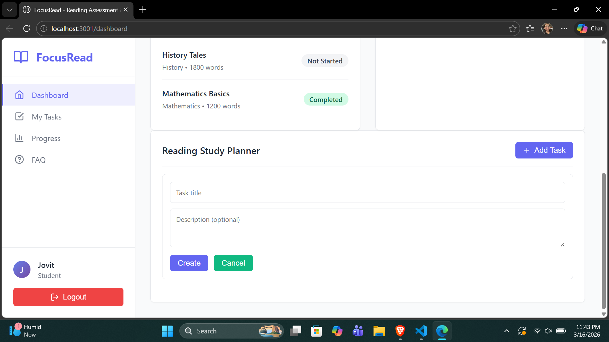
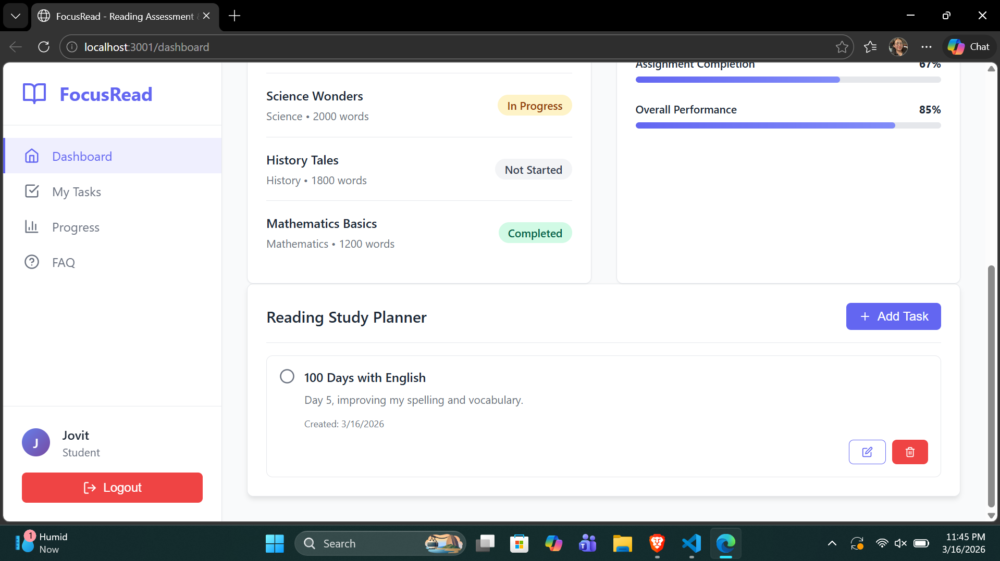
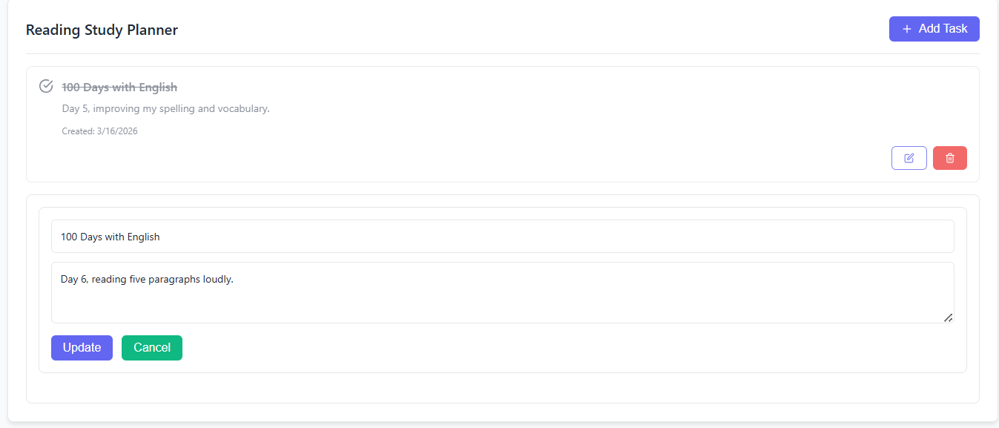
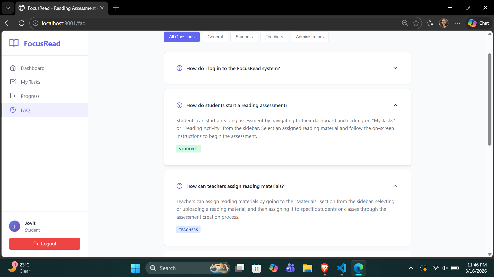
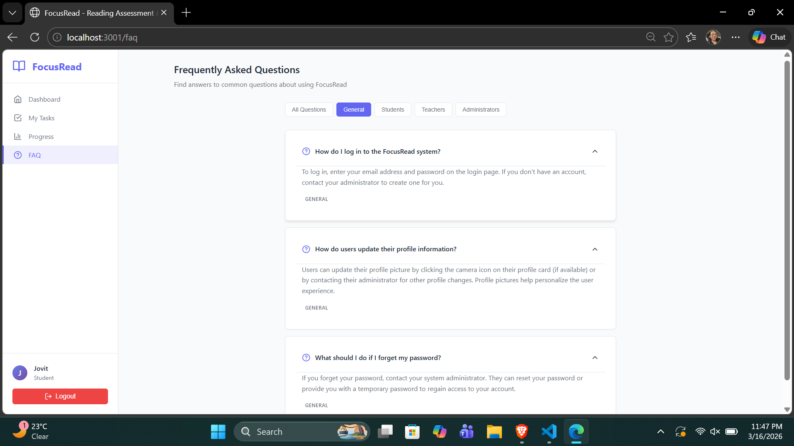
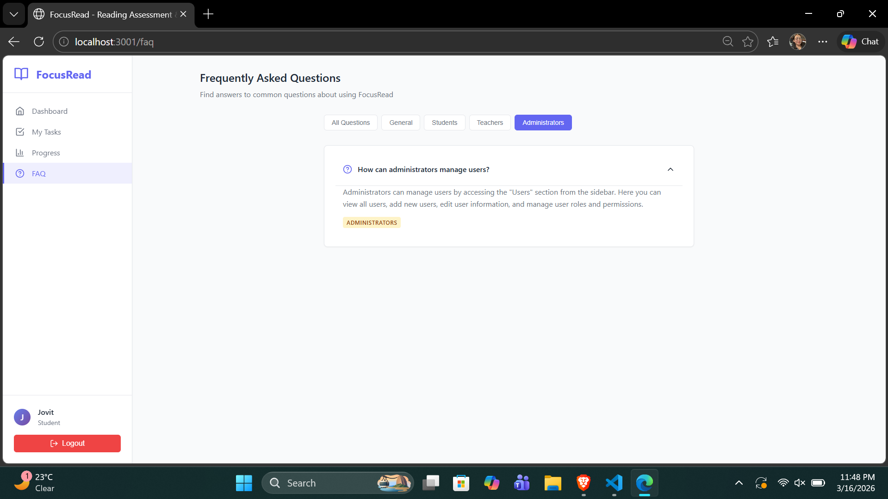

  

A progressive <a href="http://nodejs.org" target="_blank">Node.js</a> framework for building efficient and scalable server-side applications.

Feature Implementation Summary

Name: Loayon, Rynard Janver Kin L.
Section: BSICT - 3B1

Implemented Features:
Reading Study Planner
FAQ Section

Feature 1: Reading Study Planner

Purpose

The Reading Study Planner helps students organize their reading-related tasks and notes while using the FocusRead: Online Reading Assessment and Monitoring System. It allows students to plan their reading activities, keep reminders about assigned passages, and track their study progress. This feature supports better time management and improves students’ focus on completing reading tasks and assessments.

Expected User

Students

Main Functionality

The Reading Study Planner allows students to create and manage study tasks related to their reading assignments. Students can add notes or reminders, edit their tasks, mark tasks as completed, and delete tasks that are no longer needed. All tasks are displayed on the student dashboard so students can easily monitor their study activities.

Acceptance Criteria

Students can create a new reading task or study note by entering a title and description.

Students can view all their study tasks in the Reading Study Planner section of the dashboard.

Students can mark a task as completed, and the system updates the task status.

Students can edit or delete existing tasks or notes if they want to update or remove them.

What I Implemented

I implemented a Reading Study Planner feature where students can manage their reading-related tasks. Students can create study tasks with a title and description, view their tasks on the dashboard, update existing tasks, mark tasks as completed, and delete tasks when they are no longer needed. This feature helps students organize their reading activities and track their study progress within the system.

Problems or Challenges Encountered

One challenge encountered was designing the task management structure, such as determining how tasks should be created, updated, and marked as completed within the system. Another challenge was organizing the user interface so that tasks are clearly displayed on the student dashboard, making it easy for students to manage their study plans.

Feature 2: FAQ Section

Purpose

The FAQ (Frequently Asked Questions) Section provides users with quick answers to common questions about using the FocusRead: Online Reading Assessment and Monitoring System. This feature helps students, teachers, and administrators understand how to use the system properly without needing direct assistance. It improves user experience by providing helpful information and guidance within the system.

Expected User

Students, Teachers, and Admin

Main Functionality

The system includes a FAQ Page where users can view frequently asked questions and their corresponding answers. Users can access this page through the navigation menu. The FAQ page displays common questions related to system usage, such as how to take reading assessments, view progress reports, or manage reading materials.

Each FAQ item displays a question and its corresponding answer in a clean and readable format. The questions can be presented in a collapsible or list format so users can easily browse the information.

Acceptance Criteria

Users can access the FAQ page from the system navigation menu.

The FAQ page displays a list of frequently asked questions with their corresponding answers.

Users can easily read and browse the questions and answers through a clear and organized layout.

The FAQ section provides helpful guidance related to system usage, such as reading assessments, progress monitoring, and account management.

What I Implemented

I implemented a FAQ page that displays common questions and answers related to the system. Users can access the FAQ section from the navigation menu, where they can read helpful information about how to use different features of the FocusRead system, such as reading assessments, progress monitoring, and account management.

Problems or Challenges Encountered

One challenge encountered was deciding which questions and answers should be included in the FAQ section so that they would be helpful for users. Another challenge was organizing the questions and answers in a clear layout, ensuring that users can easily read and understand the information.

Screenshots

Reading Study Planner

FAQ Section

